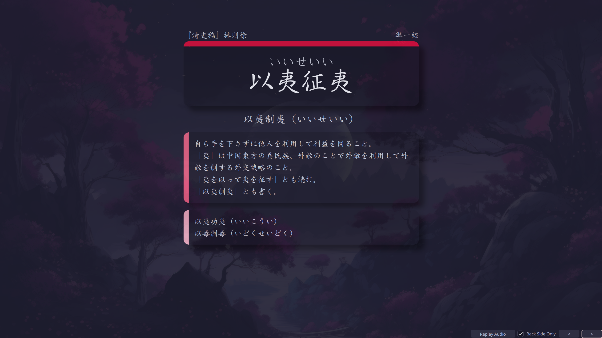

## Styling for the [Anki Yojijukugo Deck](https://ankiweb.net/shared/info/864055913).

### Front of Card:

### Back of Card:

### Fields Required:
- Word
- Reading
- Definition
- Variants
- Source
- Level
- Synonyms